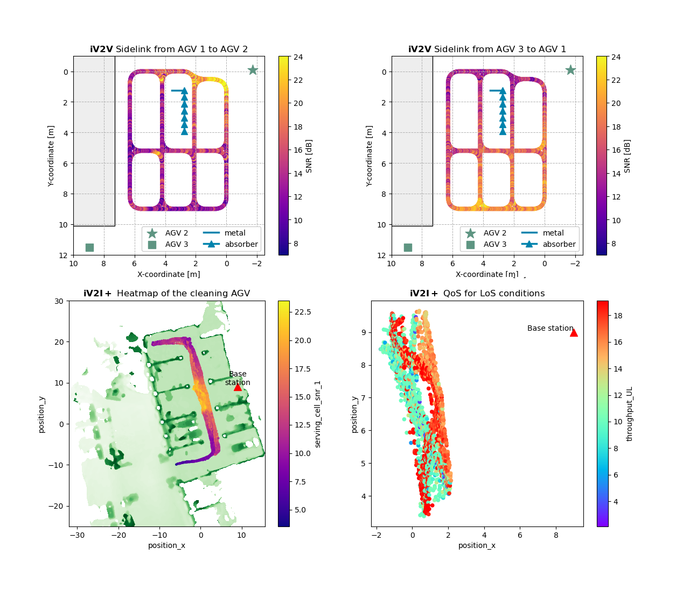

# AI4Mobile Industrial Datasets 
[][pandas]
[][numpy]

[Download the datasets on IEEE Dataport](https://ieee-dataport.org/open-access/ai4mobile-industrial-datasets-iv2v-and-iv2i)

We provide 2 datasets: [iV2V](#iv2v) (industrial Vehicle-to-Vehicle) and [iV2I+](#iv2i) (industrial Vehicular-to-Infrastructure + sensor). Both datasets provide information from several sources in different granularity. For ease of use, parquet files containing direct translations of the raw data are provided in respective sources folders.

In the following, an overview of the data is provided. For a detailed description of the measurement campaigns please refer to the paper
(_Preprint to be published soon_).

## Requirements

[bagpy]: https://jmscslgroup.github.io/bagpy/index.html
We strongly recommend to work on Python with the following libraries:

* [pandas]
* [pyarrow](https://arrow.apache.org/docs/python/index.html)

Furthermore, we suggest some additional libraries to process and analyze the data, such as:

[numpy]: https://numpy.org/
[pandas]: https://pandas.pydata.org/

* [numpy] for common mathematical tools
* [matplotlib](https://matplotlib.org/) for plotting
* [scikit-learn](https://scikit-learn.org/stable/) for ML analysis
* [bagpy] for ROS bag files

## File overview


The following data is provided both for [iV2V](#iv2v) and [iV2I+](#iv2i):

1. A combined dataframe with selected features for direct usage, in [parquet](https://parquet.apache.org/) format.
2. A compressed file `*-sources.zip`, with the different data sources transformed to individual parquet files.
3. Several compressed files with the unedited raw data sources in their original file formats, as `*-sources/raw/*.zip`.
   - The bag files `iV2Ip-sources/raw/sensors/*.bag` constitute an exception, since they are already compressed and a single zip file with all of them would have a size of >250 GB.
4. Metadata from all features in the combined dataframes, as `*_info.csv`

# iV2V


## Quickstart

Head to the *iV2V.parquet* file, and load it in pandas to inspect the columns. Some general information on each column can be found in [iV2V_info.csv](./iV2V_info.csv)

The dataframe contains information from the sidelink as extracted from RUDE and Crude, including:

* time of arrival and signal strength measurements
* the location of AGV1 within the test track
* labels to identify source and destination AGVs.

Sidelink and location data have been matched on the epoch timestamps with a small error tolerance.
The wall scenarios "A" and "B" are also provided as labels as noted down during the measurements.

## Data Overview

[rude]: https://rude.sourceforge.net/
Sources:

1. [RUDE & CRUDE][rude] for sidelink communication
2. Localization data provided from the AGV's sensors.

### Sidelink

The packets were transmitted roughly every **20 ms**. This reference value, together with the provided timestamps, can serve as a basis to estimate packet error rate.

The sidelink data extracted from the incoming messages for any given AGV are provided as separate parquet files among the iV2V sources (e.g., sidelinkX_df.parquet with X the id of the AGV).
For a detailed insight of the sidelink signal parameters, check the dataset publication or RUDE's [documentation][rude].

### Localization

The AGV1 localization data is provided in .txt format as tab-separated-values containing the following fields:

* Sidelink Epoch Time [sec] - As unix epoch timestamps
* X-coordinate [m]
* Y-coordinate [m]

The update period for the localization data is approximately **50 ms**.

# iV2I+


## Quickstart

Head to the *iV2Ip.parquet* file, and load it in pandas to inspect the columns. Some general information on each column can be found in [iV2Ip_info.csv](./iV2Ip_info.csv)

The dataframe contains:

* radio data (RSRP, RSRQ, SINR, RSSI)
* basic sensor data (x and y location, speed)
* throughput and delay measurements
* additional calculated features like the Line of Sight (LoS) or the cell load

Each source has a particular update period, so they all have been resampled to **1 second** while merging.
As a result, information loss can be expected.

For detailed information about the columns and information in higher resolution, read below.

## Data Overview

[mi]: http://www.mobileinsight.net/
[ros]: https://wiki.ros.org/noetic
[tcpdump]: https://www.tcpdump.org/
[iperf]: https://iperf.fr/iperf-doc.php
[ping]: https://linux.die.net/man/8/ping
Sources:

1. [Mobile Insight][mi]
2. [TCP Dump][tcpdump]
3. [Iperf]
4. [Ping]
5. [ROS sensor data][ros]

Except for the Sensor Data, all measurement software is Open Source and free of use.

### Mobile Insight

All information captured by [Mobile Insight][mi] from available LTE channels. The available information also depends on the modem of the measurement device.

The "rs_intra_all" file contains RSRP and RSRQ information in a resolution of **40 ms** for the measurement campaign.

Alternatively, RSRP and RSRQ values were logged together with SNR and RSSI directly into the AGV-mounted mini PC every **200 ms** as _cell_info_yyyymmdd-HHMMSS.log_. These logs are merged and available in the sources as "cell_df.parquet"

### TCP Dump

[TCP Dump][tcpdump] is a packet analyzer that allows tracking transmitted packets and their properties (e.g. payload, size of the packet).

During the measurement campaign, TCP Dump was run on both server and the mini-PC which was attached to the AGV. This allows reconstructing e.g. the packet delay ( $P_{server}-P_{agv}$ or $P_{agv}-P_{server}$ for Uplink and Downlink, respectively). Since the time synchronization was not running consistently (max. break of 30 min), errors in the area of single-digit ms can be expected using this information.

The parquet files contain already information from both server and client side and each packet is listed with respective fields if it is either an ICMP, TCP or UDP packet. For the UDP packets also the delay between sending and receiving entity is included, as well as if a packet has arrived. The parquet files are split between Uplink and Downlink and also between the different days.

### Iperf

[Iperf] is a speed test application that enables measuring the bandwidth and jitter of a UDP or TCP connection.

In the measurement campaign, Iperf was run on both a mini PC and server to receive throughput measurements with a granularity of **1s**. For experiments that require high accuracy, it is recommended to use the TCP dump based information since the information was collected one time per second, but not at the beginning of each second.

### Ping

Collected from the console command `ping`.

### ROS sensor data

Sensor data was stored using [ROS] (Robot Operating System) as .bag files, which can be read e.g. with the *bagpy* library in Python. An excerpt of the available information can be seen below.

[occupancy]: https://docs.ros.org/en/noetic/api/nav\_msgs/html/msg/OccupancyGrid.html
[odom]: https://docs.ros.org/en/noetic/api/nav_msgs/html/msg/Odometry.html
[imu]: https://docs.ros.org/en/noetic/api/sensor_msgs/html/msg/Imu.html
[cloud]: https://docs.ros.org/en/melodic/api/sensor_msgs/html/msg/PointCloud2.html

| Topic                     | ROS message type                    | Update period | Description                                             |
|---------------------------|-------------------------------------|---------------|---------------------------------------------------------|
| Map static elevation      | [nav_msgs/OccupancyGrid][occupancy] | -             | Single precomputed map of the whole area                |
| Far map obstacles         | [nav_msgs/OccupancyGrid][occupancy] | **50 ms**     | 400 $\mathrm{m}^2$ obstacle map around the AGV                    |
| Near map obstacles        | [nav_msgs/OccupancyGrid][occupancy] | **20 ms**     |  36 $\mathrm{m}^2$ obstacle map around the AGV                     |
| Odometry                  | [nav_msgs/Odometry][odom]           | **10 ms**     | Sensor-fused position, orientation and speed of the AGV |
| Inertial Measurement Unit | [sensor_msgs/Imu][imu]              | **10 ms**     | Conventional IMU data                                   |
| LIDAR                     | [sensor_msgs/PointCloud2][cloud]    | **100 ms**    | 3D point cloud with obstacles                           |

The static map and the odometry data are provided in the sources as "static_map" and "ros_df", respectively, while the remaining information can be extracted from the original bag messages.

It is important to note that "Odometry" does not refer to pure wheel odometry but sensor-fused dead reckoning using other sensor sources, e.g., IMU.
Within "ros_df", the odometry data has been downsampled to **40 ms** (considering the AGV's low speed and update rate of the communication data) and extended with:

* **distance_to_bs**: The distance to the base station, which was known and fixed to (9,9)
* **obstacles_sum**: A summation of the obstacles for Line-of-Sight (LoS) estimation. For this, the elevation values above a small threshold lying within a [Fresnel ellipse](https://en.wikipedia.org/wiki/Fresnel_zone) between AGV and base station were added together. The threshold here serves to neglect the grid values that account for ground.
* **line_of_sight**: A boolean estimate of LoS, obtained as the condition `obstacles_sum < 1000` (The threshold value "1000" has been selected a posteriori).

These added fields are computed within [odom_parser.py](iV2Ip/odom_parser.py)

# Examples

For a complete code example to explore the datasets,
check the Jupyter notebooks [iV2Ip-visualize.ipynb](iV2Ip/iV2Ip-visualize.ipynb) and
[iV2V-visualize.ipynb](iV2V/iV2V-visualize.ipynb).



# Citation

If you use the dataset, please cite it as:

```bibtex
@data{04ta-v128-22,  
doi = {10.21227/04ta-v128},  
url = {https://dx.doi.org/10.21227/04ta-v128},  
author = {Hernangomez, Rodrigo and Palaios, Alexandros and Watermann, Cara and Schäufele, Daniel and Geuer, Philipp and Ismayilov, Rafail and Parvini, Mohammad and Krause, Anton and Kasparick, Martin and Neugebauer, Thomas and Ramos-Cantor, Oscar D. and Tchouankem, Hugues and Leon Calvo, Jose and Chen, Bo and Stanczak, Slawomir and Fettweis, Gerhard},  
publisher = {IEEE Dataport},  
title = {AI4Mobile Industrial Datasets: iV2V and iV2I+},  
year = {2022} }
```
